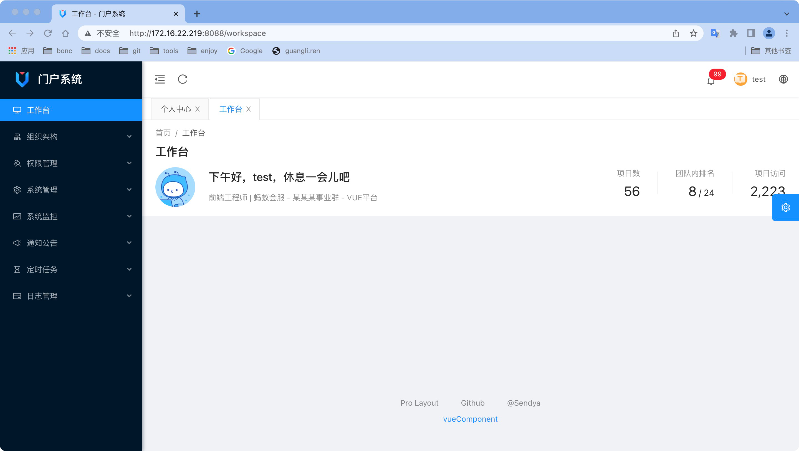

## 项目介绍
基于 spring-boot,mybatis-plus,sa-token,and-design-of-vue-admin 开发的一套后台管理系统
## 核心功能

- 组织架构
  - 组织机构管理
  - 岗位管理
- 权限管理
  - 用户管理
  - 角色管理
  - 菜单管理
- 系统管理
  - 系统配置
  - 字典管理
  - 字典项管理
- 系统监控
  - 服务监控
  - 在线用户
- 通知公告
  - 公告管理
- 定时任务
  - 任务管理
  - 执行日志
- 日志管理
  - 登录日志
  - 操作日志

内置单点登录认证中心，以及 sso-client 的 spring-boot-starter,快速集成单点
## 快速启动

确保您的电脑已安装了java8，nodejs，npm或yarn，mysql5.7

1. 启动后端

```
cd rainy/rainy-ui
npm isntall | yarn install
yarn server
```

2. 启动后端

   打开 rainy-admin 模块，修改 application-dev.properties 配置文件数据源信息，运行 RainyApplication.java 即可启动

3. 访问地址：<http://localhost:8000>

## 项目模块

```
├─rainy                     ->项目工程
│  ├─rainy-admin            ->后台接口
│  ├─rainy-common           ->通用模块
│  ├─rainy-core             ->核心模块
│  ├─rainy-task             ->定时任务模块
│  ├─rainy-dataway          ->接口开发
│  ├─rainy-sso              ->单点登录模块
```

## 单点登录

提供了 sso-client-spring-boot-starter 快速集成单点登录

引入依赖

``` xml
<dependency>
    <groupId>com.renguangli</groupId>
    <artifactId>sso-client-spring-boot-starter</artifactId>
    <version>0.0.1-SNAPSHOT</version>
</dependency>
```

在 application.properties 配置文件中添加 配置

```properties
sso.enable=true
sso.login-url=http://172.16.22.219:8088/user/login
sso.server-url=http://172.16.22.219:8088/api
sso.secret-key=kQwIOrYvnXmSDkwEiFngrKidMcdrgKor
sso.skip-urls=/sso/*
```

获取用户信息工具类

```java
Userinfo userinfo = SsoUtils.getUserinfo();
```
Userinfo 类包含的字段

```java
    private String username;
    private String name;
    private String avatar;
    private Long loginCount;
    private String lastLoginTime;
    private String lastLoginIp;
    private String browser;
    private String os;
    private List<String> roles = new ArrayList<>();
    private List<String> permissions = new ArrayList<>();
```
